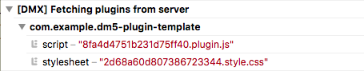

# DeepaMehta 5 Plugin Template

This project is aimed at [DeepaMehta 5](https://github.com/jri/deepamehta) plugin developers.

A plugin for the DeepaMehta platform can contain both, a server-side part, and/or a client-side part. The client-side part can either extend the standard DeepaMehta webclient, or can be a proprietary web front-end (possibly exposing its own extension mechanism).

This template project assumes you want develop a DeepaMehta 5 plugin that extends the standard DeepaMehta webclient. It is *not* suited for developing a proprietary DeepaMehta 5 web front-end. You can also use this template to add a server-side part to the plugin later on, however this is not yet demonstrated.

### Build DeepaMehta 5 from source

The template project assumes you have built DeepaMehta 5 from source.

These tools are needed:

- Java 8
- Maven
- Node.js
- git

Build from source:

```sh
git clone https://github.com/jri/deepamehta.git
cd deepamehta
mvn clean install -P all -DskipTests
```

Only when you build DeepaMehta 5 from source you will get Hot Module Replacement. Hot Module Replacement provides you a comfortable development experience.

### Clone the template project

Clone the template project inside DeepaMehta's `modules-external` directory:

```sh
cd modules-external
git clone https://github.com/jri/dm5-plugin-template.git
```

Cloning inside `modules-external` gives you 2 features without requiring manual configuration:

- For building the production version of the plugin the existing Webpack installation of the DeepaMehta installation will be reused (you don't need install Webpack for every plugin project again and again).
- The production build of your plugin is automatically copied to DeepaMehta's `bundle-deploy` directory in order to get hot deployed.

### Configure Hot Module Replacement

In `deepamehta/modules/dmx-webclient/src/main/js/plugin-manager.js` look for the comment `// while development add your plugins here` and add a `initPlugin()` call as follows:

```js
// while development add your plugins here
initPlugin(require('modules-external/dm5-plugin-template/src/main/js/plugin.js').default)
```

This gives you Hot Module Replacement. That is every time you modify any of your plugin's front-end files (e.g. `.js`, `.vue`) the browser provides you instant feedback. Hot Module Replacement is handled by Webpack Dev Server.

### Start the server(s)

1. Start the DeepaMehta back-end server:

    ```
    cd deepamehta
    mvn pax:run
    ```

    By default the DeepaMehta back-end server listens on port `8080`.

2. In another terminal: start the Webpack Dev Server:

    ```
    cd deepamehta
    npm run dev
    ```

    The Webpack Dev Server (which listens on port `8082`) will build the DeepaMehta webclient along with your plugin (as you have added it to `plugin-manager.js`), and then launches the webclient along with your plugin in a browser window (`http://localhost:8082`).

### What the example plugin does

The example plugin mounts a "Greetings!" button into the webclient's toolbar. Every time you click it another "Greetings" Note topic is created (but not revealed).


Although this is trivial functionality the plugin's source code demonstrates a couple of crucial plugin concepts:

* Mounting Vue.js components into the DeepaMehta webclient
* Registering a Vuex store module for managing the plugin's state
* Injecting DeepaMehta libraries (e.g. DM5 Core types, DM5 REST client) into components and store module

### Start developing

Now adapt the example plugin to your own needs. Every DeepaMehta plugin which extends the standard webclient has a `src/main/js/plugin.js` file. The `plugin.js` file declares the various assets your plugin provides (e.g. Vue.js components, Vuex store module). Start your inspection there.

While development the result of every modification you make is immediately visible in the browser due to Hot Module Replacement.

### Build plugin for production

```sh
cd dm5-plugin-template
mvn clean package
```

This will build a `.jar` file for production and copy it to DeepaMehta's `bundle-deploy` directory. The `.jar` file contains your plugin (minified Javascript, extracted CSS, both hashed for longterm caching) and is deployable in every DeepaMehta 5 installation. The production build is handled by Webpack. The DeepaMehta backend server serves the plugin front-end assets via http(s).

Test the production build of your plugin by opening the webclient, but this time as served from the DeepaMehta back-end server `http://localhost:8080/systems.dmx.webclient/` (note that the trailing slash is needed). The "Greetings!" button is supposed to appear and function like before. But note that this time the DeepaMehta webclient fetches the plugin's front-end assets (Javascript, CSS) from the DeepaMehta back-end server (no dev server involved). You can see this in the browser console:



## Version History

**0.6** -- Mar 30, 2020

* Improvement:
    * Support code splitting also for CSS
* Chore:
    * Adapt to `clean-webpack-plugin` 3.0
* Requires DMX 5.0-beta-7

**0.5** -- Nov 25, 2019

* Improvement:
    * Default config supports code splitting
* Chore:
    * Adapt to DMX 5.0-beta-6
    * Revised README

**0.4.1** -- Apr 24, 2019

* Chore:
    * Adapt to newer `clean-webpack-plugin`
    * Depends on DMX 5.0-beta-2

**0.4** -- Feb 4, 2019

* Plugin production build:
    * CSS extraction
    * Add hashes to js and css files to support longterm caching
    * Remove old builds
* More example code annotations
* Simplified pom.xml
* Change license to `GPL-3.0-or-later`

**0.3** -- Oct 14, 2018

* Illustrates dependency injection (`dm5`, `axios`, `Vue`)
    * into `plugin.js`
    * into a Vuex store module
    * into a Vue component
* Illustrates CSS usage
* New script `stats` runs the Webpack Bundle Analyzer
* Uses the Webpack installation of the DMX platform

**0.2** -- Mar 26, 2018

**0.1** -- May 1, 2017
